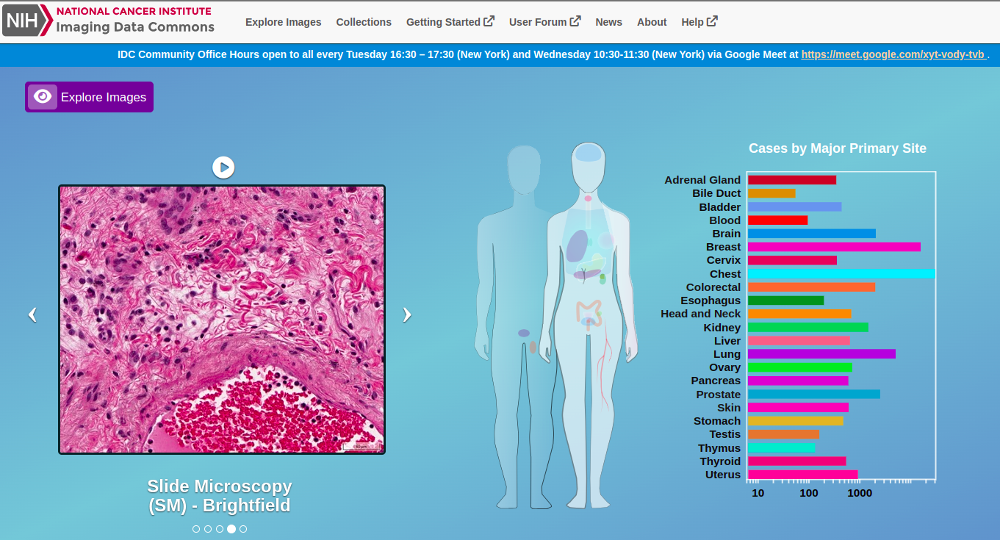

# Introduction to working with digital pathology images in IDC
This repository contains a short notebook (lung_cancer_cptac_DataExploration.ipynb) giving an idea on how to explore available collections of pathology whole-slide images (WSIs) in the IDC. 

More elaborate tutorials on how to train a tissue classification model can be found in the Github repository [idc-comppath-reproducibility](https://github.com/ImagingDataCommons/idc-comppath-reproducibility) as part of the paper ["The NCI Imaging Data Commons as a platform for reproducible research in computational pathology"](https://doi.org/10.1016/j.cmpb.2023.107839).

